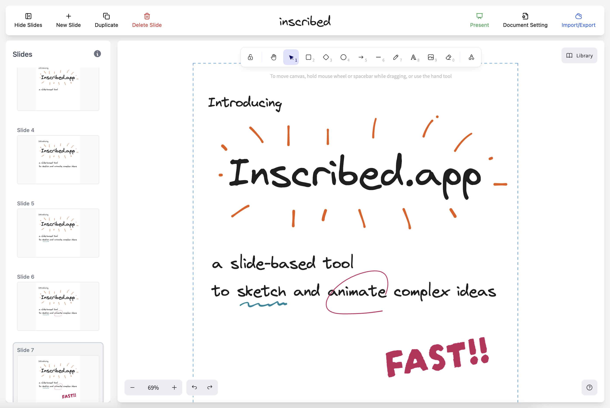

# inscribed.app

A slide-based tool for fast sketching and animating ideas.

🎥 [Watch Demo on YouTube](https://youtu.be/Aw5mxqPXhKE) | 🚀 [Try Inscribed](https://inscribed.app) | [Feedback](https://github.com/chunrapeepat/inscribed/issues)

## Features

- 🎨 Interactive drawing canvas powered by Excalidraw
- ⌨️ Keyboard shortcuts support
  - Copy/Paste functionality
  - Navigation with Up/Down arrows
  - Delete items
- 📏 Customizable document size
- 🖼️ Image import and manipulation
- 🔤 Google Fonts integration
- 🎭 Presentation mode for slideshows
- 📤 Export presentations as GIF
- 💾 Export/Import data functionality
- 🔗 Embed support via iframe

## Getting Started

1. Fork the repository
2. Clone your fork: `git clone https://github.com/YOUR_USERNAME/inscribed.git`
3. Create a new branch: `git checkout -b feature/your-feature-name`
4. Install dependencies: `npm install`
5. Start the development server: `npm run dev`

---

Crafted with 🧡 by [@chunrapeepat](https://chunrapeepat.com)
