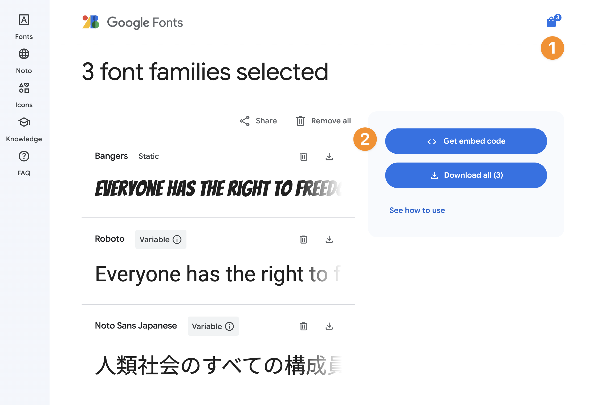
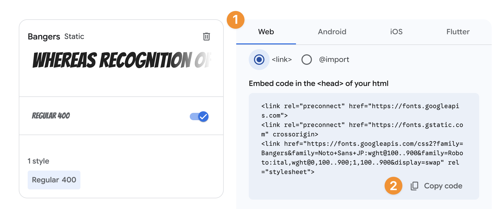
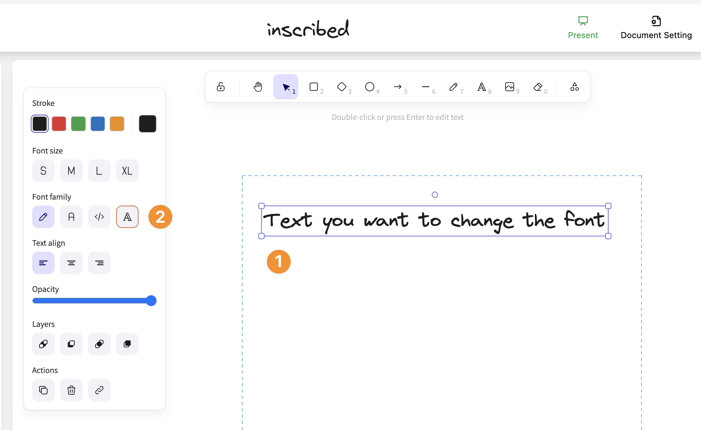
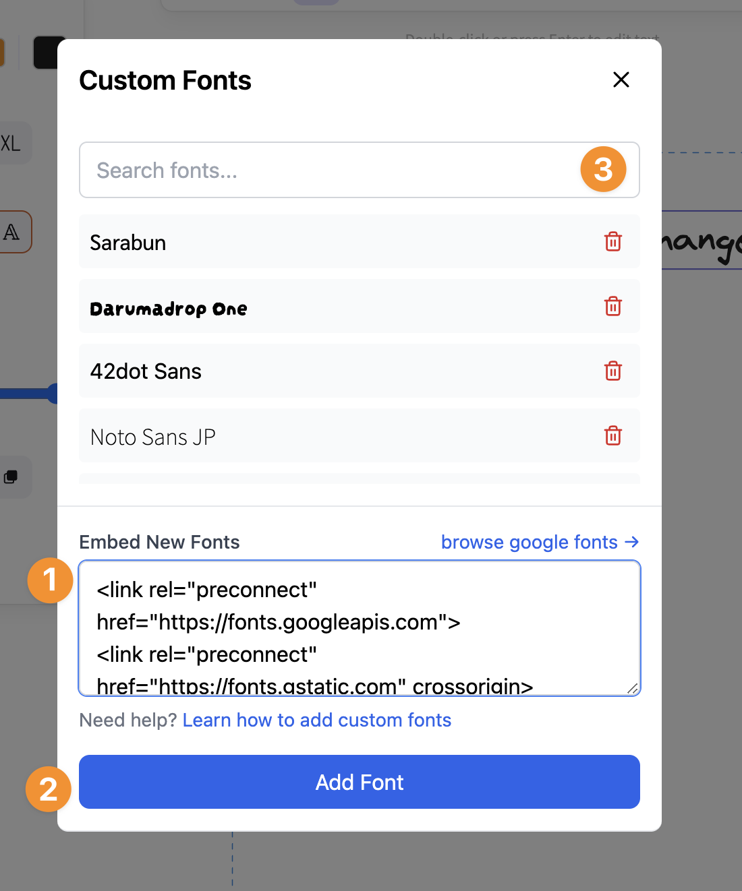

# How to use Google fonts?

### How to add Google fonts?

1. Visit [Google Fonts](https://fonts.google.com) and select your desired fonts.

2. Click **“View selected families”** button on the top right conner and click **“Get embed code”**

   

3. Select **“Web”** tab (choose either `<link>` or `@import`) then click **“Copy Code”**

   

4. Open **“Custom Fonts Modal”** by select any text on the canvas and click the custom font icon.

   

5. Paste **the code** to the **“Embed New fonts”** textarea then click **“Add Font.”**

   

Now you should see the added fonts listed above. You can search the font family name in the search input and click on the font text to apply the font family to the selected text elements.
