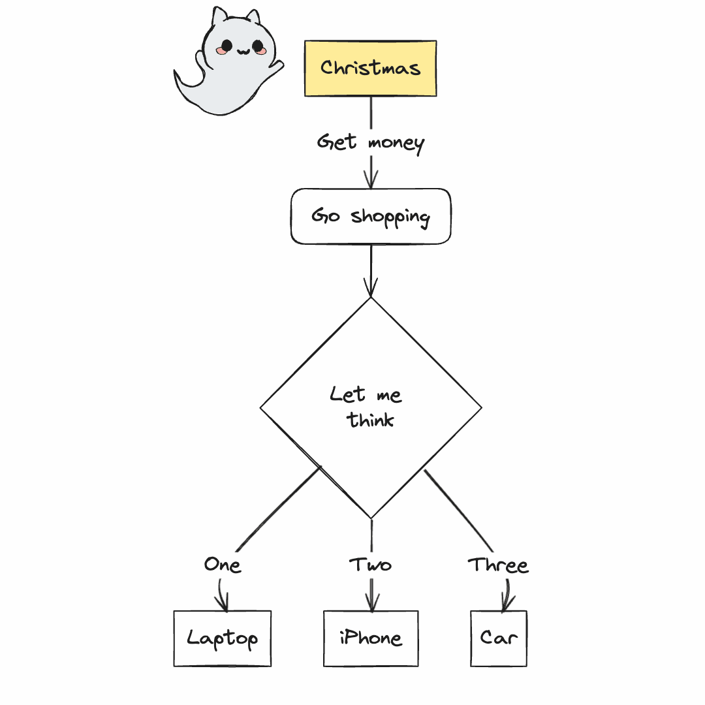
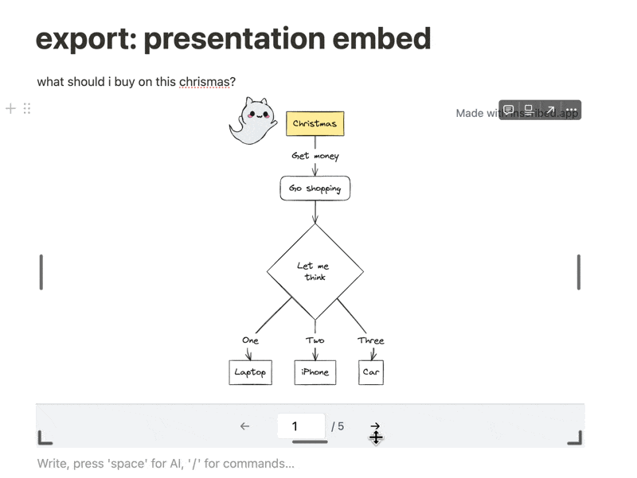
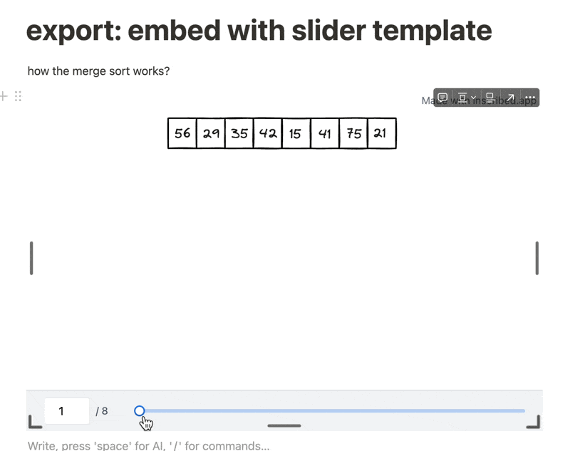

# How each export options work?

### Import/Export Data

Import and export data for working with Inscribed editor. (you will get: `filename.ins`)

Warning: The import option will override the existing data stored on the browser. Always backing up the data and be careful when import.

### Export as GIF

Export as GIF file to use on your blog, documentation, or posting on social media.

**Example GIF:**

   

### Export as Hand Drawn Animation Video (Self recording)

Export your slides as a sequence of hand-drawn animations that play one after another. This feature lets you:

- Show your content with an engaging hand-drawn animation effect
- Record the animations using your own screen recording tools
- Create professional-looking videos for social media or educational content
- Control playback with frame navigation and playback controls

How it works:

1. Click "Preview and Self-Record" to display the animation in fullscreen
2. Use the control panel to play all frames sequentially or navigate between frames
3. Use your preferred screen recording tool (QuickTime, OBS, etc.) to capture the animation
4. Create your video with perfectly timed hand-drawn animations

This is ideal for creating:

- Tutorial videos showing step-by-step processes
- Social media content with engaging animations
- Educational videos where concepts build upon each other
- Presentation recordings with hand-drawn visual elements

### Export as PDF

Export all your slides as a multi-page PDF document. This is useful for:

- Sharing your presentation as a document
- Printing your slides
- Archiving your presentation in a standard document format
- Including your presentation in reports or documentation

### Export as Video

Export your slides as an MP4 video with customizable frame timing. This is ideal for:

- Presenting your slides as a video during conferences or meetings
- Uploading to video platforms like YouTube or Vimeo
- Embedding in websites or presentations that support video
- Sharing on social media platforms that prioritize video content

You can also enable the loop option to create a video with a specific duration:

- Check the "Loop video to reach total duration" option
- Set your desired total duration in seconds
- The slides will automatically loop to reach the specified duration

This is useful for creating looping videos for digital signage, kiosks, or continuous displays.

### Embed Presentation

Create an iframe embed code in **"presentation format"** to embed everywhere. Recommended for explaining something in a step-by-step presentation format.

   

### Embed with Slider Template

Create an iframe embed code in **"slider template format"** to embed everywhere. Recommended for visualizing some ideas or process e.g. algorithm.

   

### Get Shareable Link

Generate a direct shareable link from your Gist URL for easy sharing. This option provides a simple URL that can be shared via email, chat, or social media without embedding. The link can be opened directly in a browser to view the presentation.

## Working with GitHub Gists

For the embed and shareable link options, you need to save your presentation data to a GitHub Gist. Here are some helpful tips:

### Using Multiple Files in a Single Gist

If your Gist contains multiple valid Inscribed files, the system will automatically detect them and display a dropdown menu for you to select which file to use.

### Direct File Links

You can link directly to a specific file in a Gist using the filename parameter in the URL. For example:

```
https://gist.github.com/username/gistid?filename=presentation.ins
```

When a Gist contains multiple files with valid Inscribed data, the system automatically adds this parameter to specify which file to use. This allows you to share a direct link to a specific presentation within a multi-file Gist.
